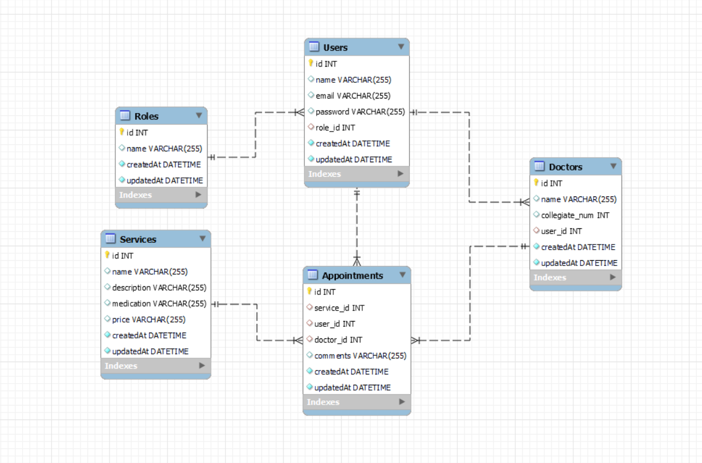

<h3 align="center">🦷 Proyecto de backend para una clínica dental 🦷</h3>

---

<details>
  <summary><b>Índice</b> 📝</summary>
  <ol>
    <li><a href="#proyecto">Proyecto</a></li>
    <li><a href="#stack">Stack</a></li>
    <li><a href="#diagrama-bd">Diagrama</a></li>
    <li><a href="#instalación-en-local">Instalación</a></li>
    <li><a href="#endpoints">Endpoints</a></li>
    <li><a href="#licencia">Licencia</a></li>
    <li><a href="#agradecimientos">Agradecimientos</a></li>
  </ol>
</details>

#### Proyecto

Este proyecto consistía en el backend correspondiente al sistema de gestión de citas para una Clínica Dental. Para ello debíamos crear una API conectada a una base de datos MySQL con relaciones entre sus tablas. 

---
#### Stack 
<div align="center">

<a href="https://www.expressjs.com/">
    
</a>
<a href="https://nodejs.org/es/">
    
</a>
 
<a href="https://developer.mozilla.org/es/docs/Web/JavaScript">
    
</a>
 
<a href="https://www.docker.com/">
    
</a>
<a href="https://git-scm.com/">
    
</a>
 

</div>

---

#### Diagrama



#### Instalación en local

1. Clonar el repositorio
2. ` $ npm install `
3. `$ express nodemon sequelize sequelize-cli mysql2 bcrypt jsonwebtoken`
4. ``` $ npx sequelize-cli db:migrate ``` 
5. ``` $ npx sequelize-cli db:seed:all ``` 
6. ``` $ npm run dev ``` 

---

#### Endpoints

Para obtener acceso a todos los endpoints conéctate a Postman y dále click aquí:
 <!-- <div align="center"> [</div> -->

---
#### Licencia

Este proyecto ha sido realizado por Coral Jiménez, estudiante de GeeksHubs Academy en la promoción de primavera del 2023 y cuenta con una MIT License.

---
#### Agradecimientos

Sin duda este proyecto no podría haberlo hecho sin la ayuda de mis compañeros. Especial mención a Judit Grau por cogerme de la mano y no soltarme y a Eduardo Kiriakos por toda su paciencia y experiencia.

**Judit Grau** 
<a href ="https://github.com/ditgrau" target="_blank"></a>

**Eduardo Kiriakos**
<a href ="https://github.com/Edkiri" target="_blank"></a>

